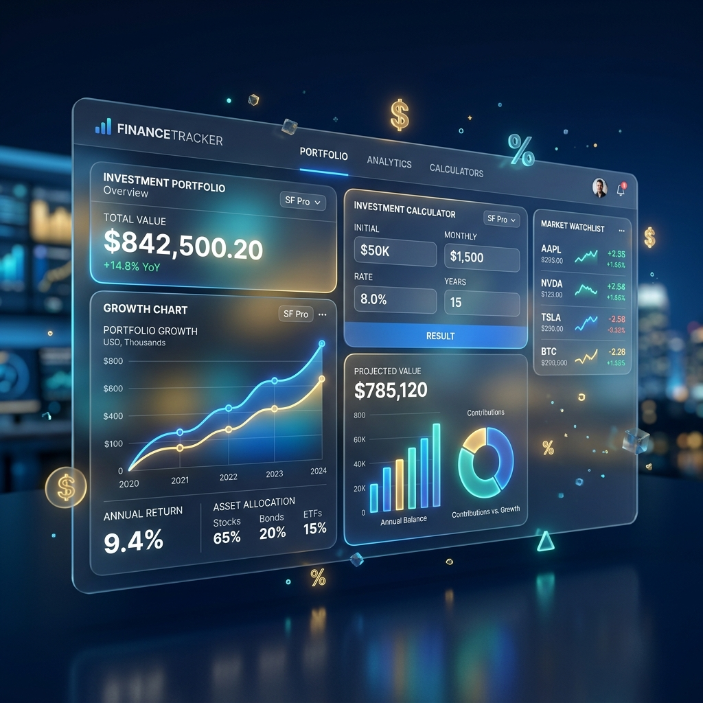

# 📈 Investment Calculator

<p align="center">
  
</p>

<p align="center">
  
  
  
  
</p>

---

## 🌟 Overview
**Investment Calculator** is a high-performance web application built with **Angular** that empowers users to visualize their long-term financial growth. Whether you're planning for retirement or just curious about the power of compound interest, this tool provides a clear, data-driven roadmap for your financial future.

## ✨ Key Features
- 🚀 **Real-time Engine**: Instantly recalculates results as you adjust your investment parameters.
- 📊 **Dynamic Visualization**: A clean, tabulated breakdown of your investment's year-over-year progress.
- 📱 **Fully Responsive**: Optimized for a premium experience across all devices, from mobile to ultra-wide monitors.
- 🎨 **Modern UI/UX**: Designed with a focus on simplicity, elegance, and user engagement.
* 💰 **Comprehensive Metrics**: Track Annual Profit, Total Interest, and Accumulated Capital with precision.

## 🛠️ Tech Stack
- **Framework**: [Angular](https://angular.io/) (Latest Version)
- **Language**: [TypeScript](https://www.typescriptlang.org/)
- **Styling**: Vanilla CSS with modern Flexbox/Grid layouts
- **Icons**: Emoji & SVG for a lightweight, fast-loading experience

## 🚀 Getting Started

### Prerequisites
Ensure you have the following installed on your machine:
* [Node.js](https://nodejs.org/) (v18.x or higher)
* [Angular CLI](https://angular.io/cli)

### Installation & Local Development

1. **Clone the repository:**
   ```bash
   git clone https://github.com/ahmed-hamada-hassan/Investment-Calculator-Simple-Project.git
   ```

2. **Install dependencies:**
   ```bash
   npm install
   ```

3. **Launch the app:**
   ```bash
   ng serve --open
   ```
   Navigate to `http://localhost:4200/` to see the application in action!

## 📊 Investment Parameters Explained
* **Initial Investment**: The base amount you start with.
* **Annual Contribution**: The fixed amount you plan to add every year.
* **Expected Return**: Your estimated annual percentage yield (APY).
* **Investment Duration**: The total number of years you plan to hold the investment.

## 🤝 Contributing
We love contributions! If you'd like to improve the calculator, please follow these steps:
1. Fork the Project
2. Create your Feature Branch (`git checkout -b feature/AmazingFeature`)
3. Commit your Changes (`git commit -m 'Add some AmazingFeature'`)
4. Push to the Branch (`git push origin feature/AmazingFeature`)
5. Open a Pull Request

## 📜 License
Distributed under the MIT License. See `LICENSE` for more information.

---
<p align="center">
  Developed with ❤️ by <a href="https://github.com/ahmed-hamada-hassan">Ahmed Hamada</a>
</p>
